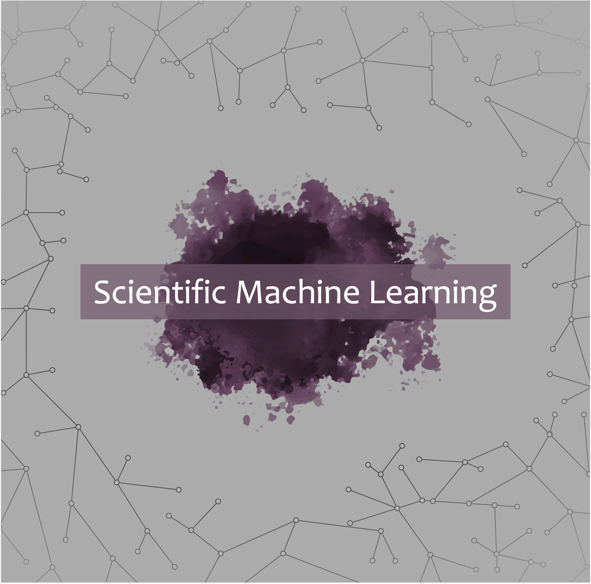

# Rheoinformatic

Welcome to the Rheoinformatic Lab at Northeastern University! Our research focuses on computational methods for studying rheology -- the science of complex fluids. We use computational modeling, network science, and machine learning techniques to study and predict the properties of complex and structured fluids.

  

    
    Colloidal Systems
  

  

    
    Network Science
  

  

    
    Scientific Machine Learning
  

  

    
    Blood Rheology
  

<!-- section break -->

<!-- section full -->

